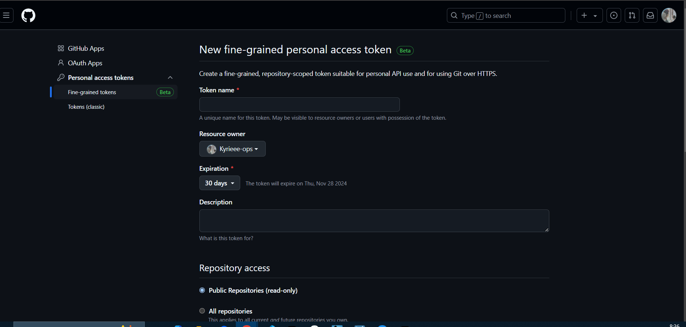
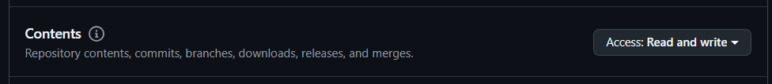

# s3-cicd deploy command
aws cloudformation deploy \
--stack-name s3-cicd-stack \
--template-file s3-cicd.yml \
--capabilities CAPABILITY_NAMED_IAM \
--profile Administrator

# s3-pipeline-codestar deploy command
aws cloudformation deploy \
--stack-name s3-pipeline-codestar-stack \
--template-file s3-pipeline-codestar.yml \
--capabilities CAPABILITY_NAMED_IAM \
--profile Administrator

# GitHub OAuthトークンを発行する
以下`GitHub Developers Settings`のページにてトークンを発行する
https://github.com/settings/tokens

`Generate new token`を選択する。

`Use GitHub Mobile`を使用してGitHubにサインインする。

`New fine-grained personal access token`画面にて一意のトークン名を指定し、トークンを発行する。
トークンの名前は用途がわかりやすい名前にすると良い。
今回は`CodePipeline-GitHub-Access`のようにしてみます。

Repository accessはセキュリティを考慮して`Only select repositories`を選択し、特定のリポジトリのみアクセスが必要な場合を選択します。

Codepipelineと連携するリポジトリを選択します。

Permissionsで権限設定をします。
今回の要件はCode PipelineとGitHubを連携し、GitHubへ資材をPushをトリガーに、Code Buildを実行 -> S3へ資材を格納することです。
今回は`Contens`を`Read and write`に変更しました。 (必要に応じてPull requestsやActionsなども読み書きに変更しておくと良いかと思います)

`Generated token`ボタンをクリックすると`access token`が発行されます。

トークンのPermissionsなどを編集したい場合などは対象のトークン名をクリックします。

`edit`から内容を編集することが可能です。

発行した`access token`は大事に保管しておきましょう。